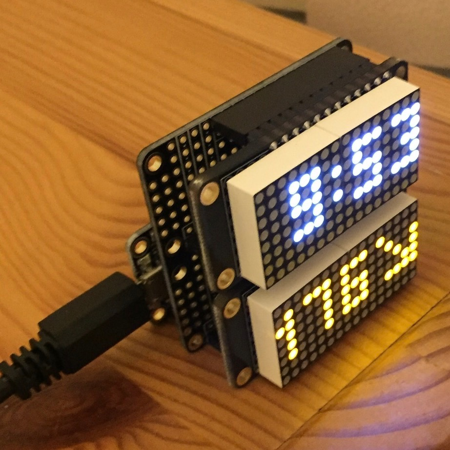

# Nightscout display

## Before you begin

Keep in mind that it's probably cheaper and easier to just buy a cheap or used
tablet or phone and have it display a nightscout site.

You need to have basic soldering skills and a basic familiarity with the
Arduino environment.

## What you need

Note: these are the components I used to build mine. You can probably
substitute other components, but you're on your own to adapt the code
accordingly.

* [Adafruit Feather M0 WiFi](https://www.adafruit.com/products/3010): the
  microcontroller that runs the code and drives the displays. Note that I could
  have used the cheaper Adafruit Feather Huzzah (ESP8266-based) instead, but it
  was out of stock when I built mine. Using the ESP8266 very likely requires
  substantial code changes.
* [Female Feather headers](https://www.adafruit.com/products/2886) (16-pin and
  12-pin female headers)
* [Adafruit LED Matrix Featherwing](https://www.adafruit.com/products/3155) in
  the color of your choice
* USB Micro-B cable and USB power supply
* Soldering iron, solder, tape, flush diagonal cutters

If all you want is just the blood glucose display, that's all you need. If you
also want a clock (like in the picture shown above), you also need:

* [Adafruit Feather Doubler](https://www.adafruit.com/products/2890)
* A second LED Matrix Featherwing, not necessarily in the same color

## Assembly

Refer to the Adafruit assembly instructions for the various components:

* [Feather M0 WiFi](https://learn.adafruit.com/adafruit-feather-m0-wifi-atwinc1500/assembly)
* [LED Matrix Featherwing](https://learn.adafruit.com/adafruit-8x16-led-matrix-featherwing/assembly)
* [Feather Doubler](https://learn.adafruit.com/featherwing-proto-and-doubler/assembly)

Assemble the components as follows:

* Solder the additional *female* headers on the top of the Feather M0 WiFi, do not use the included male headers.
* Solder the included male headers and display modules to the LED Matrix Featherwing(s) per the instructions.
* If using the clock display, solder the included female and stacking headers on the top of the Feather Doubler board.
* If using the clock display, bridge the A0 solder jumper on *one* of the featherwings.
* Attach all the boards together by placing male headers into female headers as
  appropriate. If you are using the doubler, the stacking order is: feather on
  the bottom, doubler in the middle, display modules on top.

## Install software and test

Follow the [Adafruit
instructions](https://learn.adafruit.com/adafruit-feather-m0-wifi-atwinc1500/setup)
to install the Arduino environment and install the M0 board support for the
Arduino IDE. In addition, use the library manager (Sketch→Include
Library→Manage Libraries) to install the following libraries:

* Adafruit GFX
* Adafruit LED backpack
* WiFi101
* Time

After installing all the software, try the following examples in the Arduino
environment to make sure the hardware is working correctly:

* Blink (File→Examples→01.Basics→Blink): this should slowly blink the red LED
  on the feather board itself (and only that one, the displays themselves will
  stay dark!). This is to make sure your Arduino environment is properly
  configured for uploading code to the feather.
* Minimatrix (File→Examples→Adafruit LED Backpack→minimatrix16x8): this should
  display a few demo patterns on the LED matrix.
  * Change `matrix.begin(0x70)` to `matrix.begin(0x71)` to test the second LED
    matrix, if appropriate.
* WiFi101 (File→Examples→WiFi101→...): use the examples for the WiFi101 library
  to test the internet connectivity. Make sure to adjust SSID and password
  according to your network and insert `WiFi.setpins(8,7,4,2)` in the `setup()`
  function to use the pins specific to the Feather M0 board.

## Configure and upload

Open the code for this project and save it into your Arduino sketch folder.
Then adjust the parameters at the top of the file as follows:

* WiFi network SSID and passphrase
* Nightscout server address
* Timezone
* Display brightness

Upload the sketch and after a bit you should see the time and blood glucose
value from your Nightscout server!

If you build one of these, I'd be very interested to hear about your
experience. Please let me know via email: ruud at ruud dot org.
